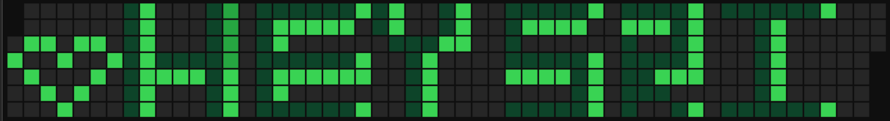

 

<h1 align="center">Hi 👋, I'm Sri</h1>
<h3 align="center">
🎨 Front-End Dev fluent in Figma & JavaScript · Dabbled in ML · SQL & DSA Learner · Curious Mind with a Passion for Clean Design and Real-World Impact 🚀
</h3>

---

# 💫 About Me:
🔭 I’m currently working on  
Building projects using **Django** to strengthen my backend development skills, while consistently practicing **Data Structures and Algorithms** to improve problem-solving.

👯 I’m looking to collaborate on  
Front-end or full-stack projects focused on **social good**, **sustainability**, or **smart UI/UX design**.

🤝 I’m looking for help with  
Deepening my understanding of **Django** and optimizing **full-stack integration**.

🌱 I’m currently learning  
**Django**, **React**, and sharpening my **DSA** skills.

💬 Ask me about  
**UI/UX Design**, **Front-End Development**, **ML Basics**, or anything related to **creative problem solving**.

⚡ Fun fact  
I once designed a full-stack app in a **24-hour hackathon** that got a *Founder’s Choice Award* — sleep can wait when ideas strike! 😄

---

## 📂 Projects

### ♻️ Recyclo
A web app for gamified waste management where users earn rewards by recycling.  
🔧 **Tech Stack:** HTML, CSS, JavaScript, Figma  
🌱 **Currently:** Improving UI, adding point-based rewards.  
🔗 [GitHub Repo](https://github.com/SRI17803/Recyclo)

---

### 🚨 Judex – Undertrial Prisoners Hackathon App
A legal access platform built in a 24-hour hackathon to support undertrial prisoners.  
🏆 **Awarded:** *Founder’s Choice Award*  
🧩 **Role:** Designed the full-stack app with a strong UI  
🔧 **Built With:** HTML, CSS, JavaScript

---

## 🌐 Socials  
  
  
  

---

## 💻 Tech Stack:
 
 
 
 
 
 
 
 
 
 
 

---

### ✍️ Random Dev Quote

